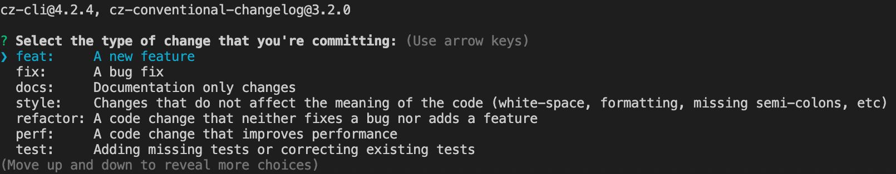
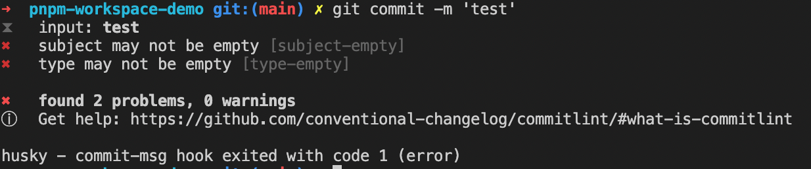

# pnpm + workspace 构建你的 monorepo 工程

## 什么是monorepo？

什么是 monorepo？以及和 multirepo 的区别是什么?

关于这些问题，在之前的一篇[介绍 lerna](https://mp.weixin.qq.com/s/4xQTeK0ViMKcCAhSg9P3Vg) 的文章中已经详细介绍过，感兴趣的同学可以再回顾下。

简而言之，`monorepo` 就是把多个工程放到一个 `git` 仓库中进行管理，因此他们可以共享同一套构建流程、代码规范也可以做到统一，特别是如果存在模块间的相互引用的情况，查看代码、修改bug、调试等会更加方便。

## 什么是 pnpm？

`pnpm` 是新一代的包管理工具，号称是**最先进的包管理器**。按照官网说法，可以实现**节约磁盘空间并提升安装速度**和**创建非扁平化的 node_modules 文件夹**两大目标，具体原理可以参考 [pnpm 官网](https://pnpm.io/zh/motivation)。

`pnpm` 提出了 `workspace` 的概念，内置了对 `monorepo` 的支持，那么为什么要用 `pnpm` 取代之前的 `lerna` 呢？

这里我总结了以下几点原因：

- lerna 已经不再维护，后续有任何问题社区无法及时响应
- pnpm装包效率更高，并且可以节约更多磁盘空间
- pnpm本身就预置了对monorepo的支持，不需要再额外第三方包的支持
- **one more thing**，就是好奇心了😜

## 如何使用 pnpm 来搭建 menorepo 工程

### 安装 pnpm

```bash
$ npm install -g pnpm
```

> ⚠️v7版本的pnpm安装使用需要node版本至少大于v14.19.0，所以在安装之前首先需要检查下node版本。

### 工程初始化

为了便于后续的演示，先在工程根目录下新建 `packages` 目录，并且在 `packages` 目录下创建 `pkg1` 和 `pkg2` 两个工程，分别进到 `pkg1` 和 `pkg2` 两个目录下，执行 `npm init` 命令，初始化两个工程，`package.json` 中的 `name` 字段分别叫做 `@qftjs/menorepo1` 和 `@qftjs/monorepo2`(*PS：@qftjs是提前在npm上创建好的组织，没有的话需要提前创建*)。

为了防止根目录被发布出去，需要设置工程根目录下 `package.json` 配置文件的 `private` 字段为 `true`。

为了实现一个完整的例子，这里我使用了 `father-build` 对模块进行打包，`father-build` 是基于 `rollup` 进行的一层封装，使用起来更加便捷。

在 pkg1 和 pkg2 的 src 目录下创建一个 `index.ts` 文件：

```ts
// pkg1/src/index.ts
import pkg2 from '@qftjs/monorepo2';

function fun2() {
  pkg2();
  console.log('I am package 1');
}

export default fun2;
```

```ts
// pkg2/src/index.ts
function fun2() {
  console.log('I am package 2');
}

export default fun2;
```

分别在 pkg1 和 pkg2 下新增 `.fatherrc.ts` 和 `tsconfig.ts` 配置文件。

```ts
// .fatherrc.ts
export default {
  target: 'node',
  cjs: { type: 'babel', lazy: true },
  disableTypeCheck: false,
};
```

```ts
// tsconfig.ts
{
  "include": ["src", "types", "test"],
  "compilerOptions": {
    "target": "es5",
    "module": "esnext",
    "lib": ["dom", "esnext"],
    "importHelpers": true,
    "declaration": true,
    "sourceMap": true,
    "rootDir": "./",
    "strict": true,
    "noImplicitAny": true,
    "strictNullChecks": true,
    "strictFunctionTypes": true,
    "strictPropertyInitialization": true,
    "noImplicitThis": true,
    "alwaysStrict": true,
    "noUnusedLocals": true,
    "noUnusedParameters": true,
    "noImplicitReturns": true,
    "noFallthroughCasesInSwitch": true,
    "moduleResolution": "node",
    "baseUrl": "./",
    "paths": {
      "*": ["src/*", "node_modules/*"]
    },
    "jsx": "react",
    "esModuleInterop": true
  }
}
```

全局安装 `father-build`:

```bash
$ pnpm i -Dw father-build
```

最后在 pkg1 和 pkg2 下的 `package.json` 文件中增加一条 `script`:

```json
{
  "scripts": {
    "build": "father-build"
  }
}
```

这样在 pkg1 或者 pkg2 下执行 `build` 命令就会将各子包的ts代码打包成js代码输出至 `lib` 目录下。

要想启动 `pnpm` 的 `workspace` 功能，需要工程根目录下存在 `pnpm-workspace.yaml` 配置文件，并且在 `pnpm-workspace.yaml` 中指定工作空间的目录。比如这里我们所有的子包都是放在 `packages` 目录下，因此修改 `pnpm-workspace.yaml` 内容如下：

```yaml
packages:
  - 'packages/*'
```

初始化完毕后的工程目录结构如下：

```
.
├── README.md
├── package.json
├── packages
│   ├── pkg1
│   │   ├── package.json
│   │   ├── src
│   │   │   └── index.ts
│   │   └── tsconfig.json
│   └── pkg2
│       ├── package.json
│       ├── src
│       │   └── index.ts
│       └── tsconfig.json
├── pnpm-workspace.yaml
└── tsconfig.root.json
```
### 安装依赖包

使用 `pnpm` 安装依赖包一般分以下几种情况：

- **全局的公共依赖包，比如打包涉及到的 `rollup`、`typescript` 等**

`pnpm` 提供了 [-w, --workspace-root](https://pnpm.io/zh/pnpm-cli#-w---workspace-root) 参数，可以将依赖包安装到工程的根目录下，作为所有  package 的公共依赖。

比如：

```bash
$ pnpm install react -w
```

如果是一个开发依赖的话，可以加上 `-D` 参数，表示这是一个开发依赖，会装到 `pacakage.json` 中的 `devDependencies` 中，比如：

```bash
$ pnpm install rollup -wD
```

- **给某个package单独安装指定依赖**

`pnpm` 提供了 [--filter](https://pnpm.io/zh/filtering) 参数，可以用来对特定的package进行某些操作。

因此，如果想给 pkg1 安装一个依赖包，比如 `axios`，可以进行如下操作：

```bash
$ pnpm add axios --filter @qftjs/monorepo1
```

需要注意的是，`--filter` 参数跟着的是package下的 `package.json` 的 `name` 字段，并不是目录名。

关于 `--filter` 操作其实还是很丰富的，比如执行 pkg1 下的 scripts 脚本：

```bash
$ pnpm build --filter @qftjs/monorepo1
```

`filter` 后面除了可以指定具体的包名，还可以跟着匹配规则来指定对匹配上规则的包进行操作，比如：
```bash
$ pnpm build --filter "./packages/**"
```
此命令会执行所有 package 下的 `build` 命令。具体的用法可以参考[filter](https://pnpm.io/zh/filtering)文档。

- **模块之间的相互依赖**

最后一种就是我们在开发时经常遇到的场景，比如 pkg1 中将 pkg2 作为依赖进行安装。

基于 pnpm 提供的 `workspace:协议`，可以方便的在 packages 内部进行互相引用。比如在 pkg1 中引用 pkg2：

```bash
$ pnpm install @qftjs/monorepo2 -r --filter @qftjs/monorepo1
```

此时我们查看 pkg1 的 `package.json`，可以看到 `dependencies` 字段中多了对 `@qftjs/monorepo2` 的引用，以 `workspace:` 开头，后面跟着具体的版本号。

```json
{
  "name": "@qftjs/monorepo1",
  "version": "1.0.0",
  "dependencies": {
    "@qftjs/monorepo2": "workspace:^1.0.0",
    "axios": "^0.27.2"
  }
}
```

在设置依赖版本的时候推荐用 `workspace:*`，这样就可以保持依赖的版本是工作空间里最新版本，不需要每次手动更新依赖版本。

当 `pnpm publish` 的时候，会自动将 `package.json` 中的 `workspace` 修正为对应的版本号。

### 只允许pnpm

当在项目中使用 `pnpm` 时，如果不希望用户使用 `yarn` 或者 `npm` 安装依赖，可以将下面的这个 `preinstall` 脚本添加到工程根目录下的 `package.json`中：

```json
{
  "scripts": {
    "preinstall": "npx only-allow pnpm"
  }
}
```

[preinstall](https://docs.npmjs.com/cli/v6/using-npm/scripts#pre--post-scripts) 脚本会在 `install` 之前执行，现在，只要有人运行 `npm install` 或 `yarn install`，就会调用 [only-allow](https://github.com/pnpm/only-allow) 去限制只允许使用 `pnpm` 安装依赖。

## Release工作流

在 `workspace` 中对包版本管理是一个非常复杂的工作，遗憾的是 `pnpm` 没有提供内置的解决方案，一部分开源项目在自己的项目中自己实现了一套包版本的管理机制，比如 [Vue3](https://github.com/vuejs/vue-next)、[Vite](https://github.com/vitejs/vite) 等。

pnpm 推荐了两个开源的版本控制工具：

- [changesets](https://github.com/changesets/changesets)
- [rush](https://rushjs.io/)

这里我采用了 [changesets](https://github.com/changesets/changesets) 来做依赖包的管理。选用 `changesets` 的主要原因还是文档更加清晰一些，个人感觉上手比较容易。

按照 [changesets 文档](https://github.com/changesets/changesets/blob/main/docs/intro-to-using-changesets.md)介绍的，changesets主要是做了两件事：

> Changesets hold two key bits of information: a version type (following semver), and change information to be added to a changelog.

简而言之就是**管理包的version**和**生成changelog**。

### 配置changesets

- 安装

```bash
$ pnpm add -DW @changesets/cli
```
- 初始化

```bash
$ pnpm changeset init
```

执行完初始化命令后，会在工程的根目录下生成 `.changeset` 目录，其中的 `config.json` 作为默认的 `changeset` 的配置文件。

修改配置文件如下：

```json
{
  "$schema": "https://unpkg.com/@changesets/config@2.0.0/schema.json",
  "changelog": "@changesets/cli/changelog",
  "commit": false,
  "linked": [["@qftjs/*"]],
  "access": "public",
  "baseBranch": "main",
  "updateInternalDependencies": "patch",
  "ignore": [],
  "___experimentalUnsafeOptions_WILL_CHANGE_IN_PATCH": {
      "onlyUpdatePeerDependentsWhenOutOfRange": true
  }
}
```

说明如下：

- changelog: changelog 生成方式
- commit: 不要让 `changeset` 在 `publish` 的时候帮我们做 `git add`
- linked: 配置哪些包要共享版本
- access: 公私有安全设定，内网建议 restricted ，开源使用 public
- baseBranch: 项目主分支
- updateInternalDependencies: 确保某包依赖的包发生 upgrade，该包也要发生 version upgrade 的衡量单位（量级）
- ignore: 不需要变动 version 的包
- ___experimentalUnsafeOptions_WILL_CHANGE_IN_PATCH: 在每次 version 变动时一定无理由 patch 抬升依赖他的那些包的版本，防止陷入 major 优先的未更新问题

### 如何使用changesets

一个包一般分如下几个步骤：

为了便于统一管理所有包的发布过程，在工程根目录下的 `pacakge.json` 的 `scripts` 中增加如下几条脚本：

1. 编译阶段，生成构建产物

```json
{
  "build": "pnpm --filter=@qftjs/* run build"
}
```

2. 清理构建产物和 `node_modules`

```json
{
  "clear": "rimraf 'packages/*/{lib,node_modules}' && rimraf node_modules"
}
```

3. 执行 `changeset`，开始交互式填写变更集，这个命令会将你的包全部列出来，然后选择你要更改发布的包

```json
{
  "changeset": "changeset"
}
```

4. 执行 `changeset version`，修改发布包的版本

```json
{
  "version-packages": "changeset version"
}
```

这里需要注意的是，版本的选择一共有三种类型，分别是 `patch`、`minor` 和 `major`，严格遵循 [semver](https://semver.org/) 规范。

**这里还有个细节，如果我不想直接发 `release` 版本，而是想先发一个带 `tag` 的 `prerelease`版本呢(比如beta或者rc版本)？**

这里提供了两种方式：

- 手工调整

这种方法最简单粗暴，但是比较容易犯错。

首先需要修改包的版本号：

```json
{
  "name": "@qftjs/monorepo1",
  "version": "1.0.2-beta.1"
}
```

然后运行：

```bash
$ pnpm changeset publish --tag beta
```

注意发包的时候不要忘记加上 `--tag` 参数。

- 通过 `changeset` 提供的 `Prereleases` 模式

  利用官方提供的 [Prereleases 模式](https://github.com/changesets/changesets/blob/main/docs/prereleases.md)，通过 `pre enter <tag>` 命令进入先进入 pre 模式。

常见的tag如下所示：

|名称|功能|
|--|--|
|alpha| 是内部测试版，一般不向外部发布，会有很多Bug，一般只有测试人员使用|
|beta| 也是测试版，这个阶段的版本会一直加入新的功能。在Alpha版之后推出|
|rc| Release　Candidate) 系统平台上就是发行候选版本。RC版不会再加入新的功能了，主要着重于除错|

```bash
$ pnpm changeset pre enter beta
```

之后在此模式下的 `changeset publish` 均将默认走 `beta` 环境，下面在此模式下任意的进行你的开发，举一个例子如下：

```bash
# 1-1 进行了一些开发...
# 1-2 提交变更集
pnpm changeset
# 1-3 提升版本
pnpm version-packages # changeset version
# 1-4 发包
pnpm release # pnpm build && pnpm changeset publish --registry=...
# 1-5 得到 1.0.0-beta.1

# 2-1 进行了一些开发...
# 2-2 提交变更集
pnpm changeset
# 2-3 提升版本
pnpm version-packages
# 2-4 发包
pnpm release
# 2-5 得到 1.0.0-beta.2
```

完成版本发布之后，退出 `Prereleases` 模式：

```bash
$ pnpm changeset pre exit
```

5. 构建产物后发版本

```json
{
  "release": "pnpm build && pnpm release:only",
  "release:only": "changeset publish --registry=https://registry.npmjs.com/"
}
```

## 规范代码提交

代码提交规范对于团队或者公司来说是非常重要的，养成良好的代码提交规范可以方便回溯，有助于对本次提交进行review，如果单纯的只是要求团队成员遵循某些代码提交规范，是很难形成强制约束的，现在我们就尝试通过工具来约束代码提交规范。

### 使用commitizen规范commit提交格式

`commitizen` 的作用主要是为了生成标准化的 `commit message`，符合 `Angular` 规范。

一个标准化的 `commit message` 应该包含三个部分：Header、Body 和 Footer，其中的 Header 是必须的，Body 和 Footer 可以选填。

```
<type>(<scope>): <subject>
// 空一行
<body>
// 空一行
<footer>
```

Header 部分由三个字段组成：type（必需）、scope（可选）、subject（必需）

- Type
`type` 必须是下面的其中之一：
  - feat: 增加新功能
  - fix: 修复 bug
  - docs: 只改动了文档相关的内容
  - style: 不影响代码含义的改动，例如去掉空格、改变缩进、增删分号
  - refactor: 代码重构时使用，既不是新增功能也不是代码的bud修复
  - perf: 提高性能的修改
  - test: 添加或修改测试代码
  - build: 构建工具或者外部依赖包的修改，比如更新依赖包的版本
  - ci: 持续集成的配置文件或者脚本的修改
  - chore: 杂项，其他不需要修改源代码或不需要修改测试代码的修改
  - revert: 撤销某次提交

- scope

用于说明本次提交的影响范围。`scope` 依据项目而定，例如在业务项目中可以依据菜单或者功能模块划分，如果是组件库开发，则可以依据组件划分。

- subject

主题包含对更改的简洁描述：

注意三点：

1. 使用祈使语气，现在时，比如使用 "change" 而不是 "changed" 或者 ”changes“
2. 第一个字母不要大写
3. 末尾不要以.结尾

- Body

主要包含对主题的进一步描述，同样的，应该使用祈使语气，包含本次修改的动机并将其与之前的行为进行对比。

- Footer

包含此次提交有关重大更改的信息，引用此次提交关闭的issue地址，如果代码的提交是不兼容变更或关闭缺陷，则Footer必需，否则可以省略。

使用方法：

#### `commitizen` 和 `cz-conventional-changelog` 

如果需要在项目中使用 `commitizen` 生成符合 `AngularJS` 规范的提交说明，还需要安装 `cz-conventional-changelog` 适配器。

```bash
$ pnpm install -wD commitizen cz-conventional-changelog
```

工程根目录下的 `package.json` 中增加一条脚本：

```bash
"scripts": {
  "commit": "cz"
}
```

接下来就可以使用 `$ pnpm commit` 来代替 `$ git commit` 进行代码提交了，看到下面的效果就表示已经安装成功了。



#### commitlint && husky

前面我们提到，通过 `commitizen` && `cz-conventional-changelog` 可以规范我们的 `commit message`，但是同时也存在一个问题，如果用户不通过 `pnpm commit` 来提交代码，而是直接通过 `git commit` 命令来提交代码，就能绕开 `commit message` 检查，这是我们不希望看到的。

因此接下来我们使用 `commitlint` 结合 `husky` 来对我们的提交行为进行约束。在 `git commit` 提交之前使用 `git` 钩子来验证信息，阻止不符合规范的`commit` 提交。

安装 `commitlint` 和 `husky`：

```bash
$ pnpm install -wD @commitlint/cli @commitlint/config-conventional husky
```

在工程根目录下增加 `commitlint.config.js` 配置文件，指定 `commitlint` 的校验配置文件：

```js
module.exports = { extends: ['@commitlint/config-conventional'] };
```

husky 配置(husky的每个版本配置不一样，具体可以参考[官方文档](https://typicode.github.io/husky/#/?id=create-a-hook)，当前的husky是v8.0.1)。

工程根目录下的 package.json 中增加一条 script:

```json
"scripts": {
  "postinstall": "husky install"
}
```

该脚本会在执行完 `$ pnpm install` 之后自动执行，进行 husky 的初始化，执行完毕后就会在根目录下创建一个 `.husky` 目录。

执行如下命令新增一个husky的hook：

```bash
$ npx husky add .husky/commit-msg 'npx --no-install commitlint --edit "$1"'
```

当我们通过 git commit 提交不符合规范的代码，就会出现如下报错，并且自动退出提交流程。



## 代码规范检查

良好的代码编写规范对团队的可持续发展起着至关重要的作用，因此接下来我会配置 `eslint` 对代码进行统一的规范校验，配合 `lint-staged` 可以对已经提交的代码进行校验。

首选需要安装 `eslint` 和 `lint-stage`。

```bash
$ pnpm install -wD eslint lint-staged @typescript-eslint/parser @typescript-eslint/eslint-plugin
```

在根成根目录下添加 `.eslintrc` 配置文件:

```js
module.exports = {
  'parser': '@typescript-eslint/parser',
  'plugins': ['@typescript-eslint'],
  'rules': {
    'no-var': 'error',// 不能使用var声明变量
    'no-extra-semi': 'error',
    '@typescript-eslint/indent': ['error', 2],
    'import/extensions': 'off',
    'linebreak-style': [0, 'error', 'windows'],
    'indent': ['error', 2, { SwitchCase: 1 }], // error类型，缩进2个空格
    'space-before-function-paren': 0, // 在函数左括号的前面是否有空格
    'eol-last': 0, // 不检测新文件末尾是否有空行
    'semi': ['error', 'always'], // 在语句后面加分号
    'quotes': ['error', 'single'],// 字符串使用单双引号,double,single
    'no-console': ['error', { allow: ['log', 'warn'] }],// 允许使用console.log()
    'arrow-parens': 0,
    'no-new': 0,//允许使用 new 关键字
    'comma-dangle': [2, 'never'], // 数组和对象键值对最后一个逗号， never参数：不能带末尾的逗号, always参数：必须带末尾的逗号，always-multiline多行模式必须带逗号，单行模式不能带逗号
    'no-undef': 0
  },
  'parserOptions': {
    'ecmaVersion': 6,
    'sourceType': 'module',
    'ecmaFeatures': {
      'modules': true
    }
  }
};
```

`lint-staged` 是 Git 里的概念，表示暂存区，`lint-staged` 表示只检查暂存区中的文件。

package.json 中增加如下配置:

```json
"lint-staged": {
    "*.ts": [
      "eslint --fix",
      "git add"
    ]
}
```

`husky` 中增加 `pre-commit` 校验：

```bash
$ npx husky add .husky/pre-commit "npx --no-install lint-staged"
```

[示例代码](https://github.com/astonishqft/pnpm-monorepo-demo)

## 参考链接

- [用 PNPM Workspaces 替换 Lerna + Yarn](https://juejin.cn/post/7071992448511279141)
- [monorepo工作流基础之changesets打开与进阶](https://blog.csdn.net/qq_21567385/article/details/122361591)